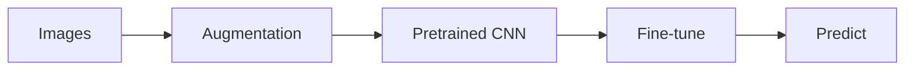

# Deep Learning

Overview
- Deep Learning (DL) uses multi-layer neural networks to learn hierarchical feature representations from large datasets.

Important subtopics
- Feedforward / Fully-connected networks
- Convolutional Neural Networks (CNNs) for images
- Recurrent Neural Networks (RNNs), LSTM/GRU for sequences
- Transformers for language and attention-based models
- Regularization (dropout, weight decay), optimizers, learning rate schedules

Key notes
- Requires more data and compute than classical ML.
- Transfer learning is powerful: pre-trained models + fine-tuning.

Quick example (image classifier)
- Use a pretrained CNN (ResNet) from a framework, fine-tune on your image dataset.

Mermaid model pipeline

Notes on images
- Include architecture diagram or training loss/accuracy curves at `images/dl_training_curve.png`.
