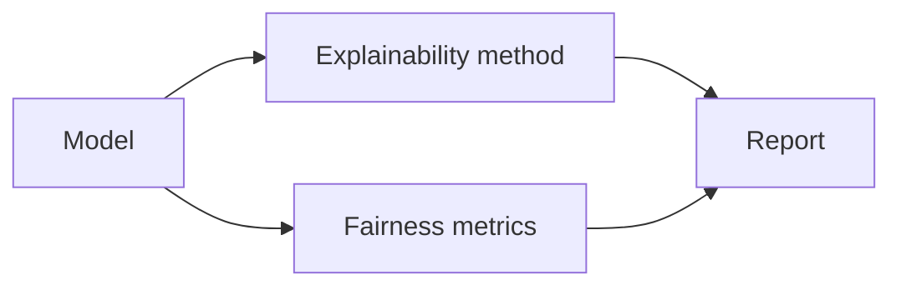

# Ethics, Safety & Interpretability

Overview
- Human-centered considerations: fairness, robustness, transparency, privacy, and alignment.

Important subtopics
- Fairness and bias testing, adversarial robustness
- Explainable AI (saliency maps, SHAP, LIME)
- Privacy-preserving ML (federated learning, differential privacy)

Key notes
- Track metrics for fairness and test models on diverse subgroups.
- Provide explanations for high-stakes decisions.

Quick example (bias check)
- Compare model performance across demographic groups; compute disparate impact ratios.

Mermaid pipeline

Notes on images
- Add example explainability visuals: `images/explainability_shap.png`.
