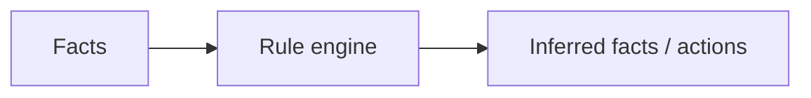

# Expert Systems & Knowledge Representation

Overview
- Expert systems encode domain rules and knowledge to perform reasoning and provide recommendations.

Important subtopics
- Rule-based systems, ontologies, semantic networks
- Reasoning engines (forward chaining, backward chaining)

Key notes
- Good for narrow domains where expert knowledge can be formalized in rules.

Quick example (medical rules)
- If symptom A and symptom B then suggest test X (rule-based diagnosis suggestion).

Mermaid pipeline

Notes on images
- Add a rule graph or ontology snippet: `images/expert_rules.png`.
