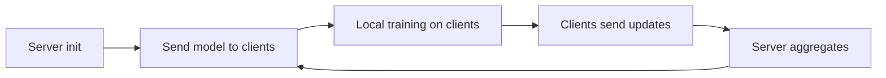

# Federated Learning & Privacy

Overview
- Federated learning trains models across many client devices while keeping raw data local for privacy.

Important subtopics
- Federated averaging (FedAvg), secure aggregation
- Differential privacy, secure multi-party computation
- System concerns: communication, stragglers, non-iid data

Key notes
- Use client sampling and compression to reduce communication costs.
- Apply differential privacy when model updates could leak private info.

Quick example (next-word prediction)
- Use FedAvg: send initial model to clients, clients train locally, send weight updates, server aggregates.

Mermaid pipeline

Notes on images
- Add client-server round diagram at `images/federated_rounds.png`.
