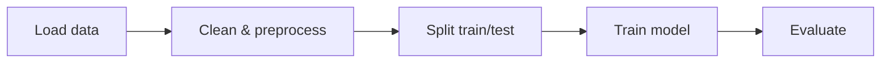
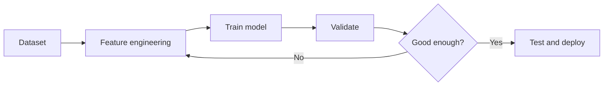

# Machine Learning

Overview
- Machine Learning (ML) is the study of algorithms that learn patterns from data to make predictions or decisions.
- The goal is to generalize from examples instead of hard-coding rules.
- ML workflows usually begin with a business question, then move to data collection, modeling, and evaluation.

Important subtopics
- Supervised Learning: labeled data (classification, regression)
- Unsupervised Learning: no labels (clustering, dimensionality reduction)
- Semi-supervised & Self-supervised Learning
- Model selection, cross-validation, and generalization
- Feature engineering, feature selection, and data preprocessing
- Bias, variance, overfitting, and underfitting
- Imbalanced learning and anomaly detection

Common algorithms
- Linear Regression and Logistic Regression
- Decision Trees, Random Forests, and Gradient Boosting
- Support Vector Machines (SVM)
- K-Means and DBSCAN for clustering
- Principal Component Analysis (PCA) for dimensionality reduction
- Naive Bayes for simple probabilistic classification

Key notes
- Always split data into train/validation/test.
- Feature engineering and scaling often matter more than model choice.
- Evaluate with appropriate metrics (accuracy, precision, recall, F1, ROC-AUC).
- Standardize or normalize features when using distance-based or gradient-based methods.
- Use cross-validation when the dataset is small or noisy.
- Check class imbalance before trusting accuracy alone.

Typical ML workflow
1. Define the problem and target variable.
2. Collect, clean, and inspect the data.
3. Split the dataset into train, validation, and test sets.
4. Encode categorical variables and scale numeric features when needed.
5. Train a baseline model first.
6. Tune hyperparameters and compare models with cross-validation.
7. Evaluate the final model on the test set.
8. Deploy, monitor, and retrain when data drifts.

Metrics by task
- Classification: accuracy, precision, recall, F1, ROC-AUC, confusion matrix
- Regression: MAE, MSE, RMSE, R2
- Clustering: silhouette score, Davies-Bouldin index

Practical tips
- Start with a simple baseline before using complex models.
- Remove data leakage by ensuring test information does not enter training.
- Keep a reproducible random seed for splits and model initialization.
- Visualize distributions, correlations, and outliers before training.

Quick example (classifier)
1. Load data (CSV).
2. Split into train/test.
3. Train a `RandomForestClassifier`.
4. Evaluate accuracy and confusion matrix.

Quick example (regression)
1. Load housing or sales data.
2. Select numeric and categorical features.
3. Train a `LinearRegression` or gradient boosting model.
4. Evaluate with MAE and RMSE.

Mini project ideas
- Predict house prices using regression.
- Classify spam emails using text features.
- Cluster customers by behavior for segmentation.
- Detect anomalies in sensor or transaction data.

Mermaid workflow

Mermaid training loop

Notes on images
- Add a dataset histogram or feature importance plot to `images/ml_feature_importance.png`.
- Add a confusion matrix or ROC curve to `images/ml_confusion_matrix.png`.
