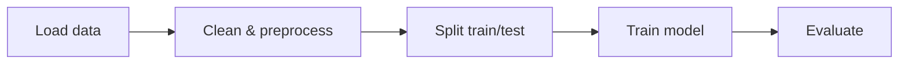
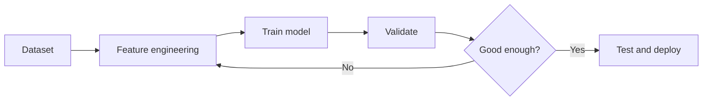

# Machine Learning

## Overview
- Machine Learning (ML) is the study of algorithms that learn patterns from data to make predictions or decisions.
- The goal is to generalize from examples instead of hard-coding rules.
- ML workflows usually begin with a business question, then move to data collection, modeling, and evaluation.

## Important Subtopics
- Supervised Learning: labeled data (classification, regression)
- Unsupervised Learning: no labels (clustering, dimensionality reduction)
- Semi-supervised & Self-supervised Learning
- Model selection, cross-validation, and generalization
- Feature engineering, feature selection, and data preprocessing
- Bias, variance, overfitting, and underfitting
- Imbalanced learning and anomaly detection

## Common Algorithms
- Linear Regression and Logistic Regression
- Decision Trees, Random Forests, and Gradient Boosting
- Support Vector Machines (SVM)
- K-Means and DBSCAN for clustering
- Principal Component Analysis (PCA) for dimensionality reduction
- Naive Bayes for simple probabilistic classification

## Key Notes
- Always split data into train/validation/test.
- Feature engineering and scaling often matter more than model choice.
- Evaluate with appropriate metrics (accuracy, precision, recall, F1, ROC-AUC).
- Standardize or normalize features when using distance-based or gradient-based methods.
- Use cross-validation when the dataset is small or noisy.
- Check class imbalance before trusting accuracy alone.

## Typical ML Workflow
1. Define the problem and target variable.
2. Collect, clean, and inspect the data.
3. Split the dataset into train, validation, and test sets.
4. Encode categorical variables and scale numeric features when needed.
5. Train a baseline model first.
6. Tune hyperparameters and compare models with cross-validation.
7. Evaluate the final model on the test set.
8. Deploy, monitor, and retrain when data drifts.

## Metrics by Task
- Classification: accuracy, precision, recall, F1, ROC-AUC, confusion matrix
- Regression: MAE, MSE, RMSE, R2
- Clustering: silhouette score, Davies-Bouldin index

## Practical Tips
- Start with a simple baseline before using complex models.
- Remove data leakage by ensuring test information does not enter training.
- Keep a reproducible random seed for splits and model initialization.
- Visualize distributions, correlations, and outliers before training.

## Important Math Formulas
$$
\begin{aligned}
y &= \beta_0 + \sum_{j=1}^{n} \beta_j x_j \\
\hat{y} &= X\beta
\end{aligned}
$$

### Linear Regression Hypothesis
$$
\hat{y} = X\beta
$$

### Mean Squared Error
$$
MSE = \frac{1}{n} \sum_{i=1}^{n} \left(y_i - \hat{y}_i\right)^2
$$

### Mean Absolute Error
$$
MAE = \frac{1}{n} \sum_{i=1}^{n} \left|y_i - \hat{y}_i\right|
$$

### Gradient Descent Update
$$
\vartheta \leftarrow \vartheta - \alpha \nabla J(\vartheta)
$$

### Logistic Regression
$$
p(y=1 \mid x) = \frac{1}{1 + e^{-z}}, \quad z = w^T x + b
$$

### Binary Cross-Entropy
$$
L = -\frac{1}{n} \sum_{i=1}^{n} \left[
y_i \log\left(\hat{p}_i\right) + \left(1-y_i\right) \log\left(1-\hat{p}_i\right)
\right]
$$

### Softmax
$$
\operatorname{softmax}(z_i) = \frac{e^{z_i}}{\sum_{j=1}^{k} e^{z_j}}
$$

### Precision, Recall, and F1
$$
\mathrm{Precision} = \frac{TP}{TP + FP}, \quad \mathrm{Recall} = \frac{TP}{TP + FN}
$$
$$
F1 = \frac{2 \cdot \mathrm{Precision} \cdot \mathrm{Recall}}{\mathrm{Precision} + \mathrm{Recall}}
$$

### Accuracy
$$
\mathrm{Accuracy} = \frac{TP + TN}{TP + TN + FP + FN}
$$

### Bayes' Theorem
$$
P(A \mid B) = \frac{P(B \mid A)P(A)}{P(B)}
$$

### Entropy
$$
H(X) = -\sum_i p_i \log_2\left(p_i\right)
$$

### Standardization
$$
z = \frac{x - \mu}{\sigma}
$$

### PCA Covariance Matrix
$$
\Sigma = \frac{1}{n} X^T X
$$

## Useful Links for Math Problems and Solutions
- Khan Academy: https://www.khanacademy.org/math
- Wolfram Alpha: https://www.wolframalpha.com/
- Math Stack Exchange: https://math.stackexchange.com/
- Paul's Online Math Notes: https://tutorial.math.lamar.edu/
- OpenStax Mathematics: https://openstax.org/subjects/math

## Quick Example: Classifier
1. Load data (CSV).
2. Split into train/test.
3. Train a `RandomForestClassifier`.
4. Evaluate accuracy and confusion matrix.

## Quick Example: Regression
1. Load housing or sales data.
2. Select numeric and categorical features.
3. Train a `LinearRegression` or gradient boosting model.
4. Evaluate with MAE and RMSE.

## Mini Project Ideas
- Predict house prices using regression.
- Classify spam emails using text features.
- Cluster customers by behavior for segmentation.
- Detect anomalies in sensor or transaction data.

## Mermaid Workflow

## Mermaid Training Loop

## Notes on Images
- Add a dataset histogram or feature importance plot to `images/ml_feature_importance.png`.
- Add a confusion matrix or ROC curve to `images/ml_confusion_matrix.png`.

## Foundations of Machine Learning

The following are core foundational areas every ML practitioner should understand. Each item is brief. Expand any section as needed.

1. Heuristics
   - Practical rules-of-thumb, feature choices, and model-selection shortcuts used to get working solutions quickly (e.g., baseline models, simple preprocessing, common hyperparameter ranges).

2. Probability & Statistics
   - Probability distributions, conditional probability, Bayesian reasoning, estimators, hypothesis testing, and uncertainty quantification.

3. Linear Algebra
   - Vectors, matrices, eigenvalues/eigenvectors, SVD, and operations used to represent data and linear models.

4. Optimization
   - Objective functions, gradient-based methods (SGD, Adam), convex vs non-convex optimization, and convergence diagnostics.

5. Algorithms & Models
   - Supervised (regression, classification), unsupervised (clustering, dimensionality reduction), ensemble methods, and neural architectures.

6. Evaluation & Validation
   - Metrics per task, cross-validation, train/validation/test splits, learning curves, and techniques for model comparison.

7. Data Processing & Feature Engineering
   - Cleaning, imputation, encoding, scaling, feature construction, selection, and pipelines for reproducibility.

8. Software Engineering & Reproducibility
   - Version control, experiment tracking, containerization, testing, and deployment practices for production-ready ML.

9. Information Theory & Learning Theory
   - Entropy, KL divergence, PAC learning notions, bias-variance tradeoff, and capacity/complexity control.

10. Ethics, Fairness & Interpretability
    - Bias mitigation, privacy, explainability methods, and assessing social impacts of ML systems.

Use this list as a checklist for learning or auditing projects — tell me which items you want expanded into practical examples, formulas, or code snippets.
