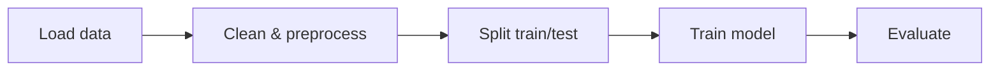
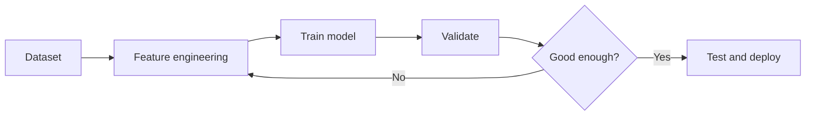

# Machine Learning

## Overview
Machine Learning (ML) studies algorithms that learn patterns from data to make predictions or decisions.
The goal is to generalize from examples instead of hard-coding rules.
Most ML workflows start with a business question and then move through data collection, modeling, and evaluation.

## Important Subtopics
### Supervised Learning
Uses labeled data for tasks such as classification and regression.

### Unsupervised Learning
Finds structure in unlabeled data through clustering and dimensionality reduction.

### Semi-Supervised and Self-Supervised Learning
Uses a mix of labeled and unlabeled data, or creates training signals from the data itself.

### Model Selection and Generalization
Focuses on cross-validation, comparing models, and measuring how well they generalize.

### Feature Engineering and Preprocessing
Covers feature creation, feature selection, cleaning, and scaling.

### Bias, Variance, Overfitting, and Underfitting
Describes the tradeoff between model simplicity, flexibility, and prediction error.

### Imbalanced Learning and Anomaly Detection
Handles rare classes and detects unusual observations.

## Common Algorithms
### Linear and Logistic Regression
Used for prediction with continuous outputs and binary classification.

### Decision Trees, Random Forests, and Gradient Boosting
Tree-based methods that combine interpretability with strong predictive performance.

### Support Vector Machines
Margin-based classifiers that work well on smaller, well-separated datasets.

### K-Means and DBSCAN
Clustering methods for grouping similar points and finding dense regions.

### Principal Component Analysis
Reduces dimensionality by projecting data onto directions of maximum variance.

### Naive Bayes
A simple probabilistic classifier that works well for text and categorical features.

## Key Notes
Always split data into train, validation, and test sets.
Feature engineering and scaling often matter more than model choice.
Use metrics that match the task, such as accuracy, precision, recall, F1, and ROC-AUC.
Standardize or normalize features when using distance-based or gradient-based methods.
Use cross-validation when the dataset is small or noisy.
Check class imbalance before trusting accuracy alone.

## Typical ML Workflow
1. Define the problem and target variable.
2. Collect, clean, and inspect the data.
3. Split the dataset into train, validation, and test sets.
4. Encode categorical variables and scale numeric features when needed.
5. Train a baseline model first.
6. Tune hyperparameters and compare models with cross-validation.
7. Evaluate the final model on the test set.
8. Deploy, monitor, and retrain when data drifts.

## Metrics by Task
### Classification
Accuracy, precision, recall, F1, ROC-AUC, and confusion matrix.

### Regression
MAE, MSE, RMSE, and R2.

### Clustering
Silhouette score and Davies-Bouldin index.

## Practical Tips
Start with a simple baseline before using complex models.
Remove data leakage by keeping test information out of training.
Keep a reproducible random seed for data splits and model initialization.
Visualize distributions, correlations, and outliers before training.

## Important Math Formulas
$$
\begin{aligned}
y &= \beta_0 + \sum_{j=1}^{n} \beta_j x_j \\
\hat{y} &= X\beta
\end{aligned}
$$

### Linear Regression Hypothesis
$$
\hat{y} = X\beta
$$

### Mean Squared Error
$$
MSE = \frac{1}{n} \sum_{i=1}^{n} \left(y_i - \hat{y}_i\right)^2
$$

### Mean Absolute Error
$$
MAE = \frac{1}{n} \sum_{i=1}^{n} \left|y_i - \hat{y}_i\right|
$$

### Gradient Descent Update
$$
\vartheta \leftarrow \vartheta - \alpha \nabla J(\vartheta)
$$

### Logistic Regression
$$
p(y=1 \mid x) = \frac{1}{1 + e^{-z}}, \quad z = w^T x + b
$$

### Binary Cross-Entropy
$$
L = -\frac{1}{n} \sum_{i=1}^{n} \left[
y_i \log\left(\hat{p}_i\right) + \left(1-y_i\right) \log\left(1-\hat{p}_i\right)
\right]
$$

### Softmax
$$
\operatorname{softmax}(z_i) = \frac{e^{z_i}}{\sum_{j=1}^{k} e^{z_j}}
$$

### Precision, Recall, and F1
$$
\mathrm{Precision} = \frac{TP}{TP + FP}, \quad \mathrm{Recall} = \frac{TP}{TP + FN}
$$
$$
F1 = \frac{2 \cdot \mathrm{Precision} \cdot \mathrm{Recall}}{\mathrm{Precision} + \mathrm{Recall}}
$$

### Accuracy
$$
\mathrm{Accuracy} = \frac{TP + TN}{TP + TN + FP + FN}
$$

### Bayes' Theorem
$$
P(A \mid B) = \frac{P(B \mid A)P(A)}{P(B)}
$$

### Entropy
$$
H(X) = -\sum_i p_i \log_2\left(p_i\right)
$$

### Standardization
$$
z = \frac{x - \mu}{\sigma}
$$

### PCA Covariance Matrix
$$
\Sigma = \frac{1}{n} X^T X
$$

## Useful Links for Math Problems and Solutions
### Khan Academy
https://www.khanacademy.org/math

### Wolfram Alpha
https://www.wolframalpha.com/

### Math Stack Exchange
https://math.stackexchange.com/

### Paul's Online Math Notes
https://tutorial.math.lamar.edu/

### OpenStax Mathematics
https://openstax.org/subjects/math

## Quick Example: Classifier
Load the data from a CSV file.
Split the data into train and test sets.
Train a RandomForestClassifier.
Evaluate accuracy and the confusion matrix.

## Quick Example: Regression
Load housing or sales data.
Select numeric and categorical features.
Train a LinearRegression or gradient boosting model.
Evaluate with MAE and RMSE.

## Mini Project Ideas
Predict house prices using regression.
Classify spam emails using text features.
Cluster customers by behavior for segmentation.
Detect anomalies in sensor or transaction data.

## Mermaid Workflow

## Mermaid Training Loop

## Notes on Images
Add a dataset histogram or feature importance plot to images/ml_feature_importance.png.
Add a confusion matrix or ROC curve to images/ml_confusion_matrix.png.

## Foundations of Machine Learning

Each item below is kept short and uses the same simple heading style as the formula section.

### Heuristics
Practical rules of thumb, feature choices, and model-selection shortcuts for getting working solutions quickly.

### Probability & Statistics
Probability distributions, conditional probability, Bayesian reasoning, estimators, hypothesis testing, and uncertainty quantification.

### Linear Algebra
Vectors, matrices, eigenvalues, eigenvectors, SVD, and the matrix operations used in data and linear models.

### Optimization
Objective functions, gradient-based methods like SGD and Adam, convex vs non-convex optimization, and convergence checks.

### Algorithms & Models
Supervised learning, unsupervised learning, ensemble methods, and neural architectures.

### Evaluation & Validation
Metrics, cross-validation, train/validation/test splits, learning curves, and model comparison.

### Data Processing & Feature Engineering
Cleaning, imputation, encoding, scaling, feature construction, selection, and reproducible pipelines.

### Software Engineering & Reproducibility
Version control, experiment tracking, containerization, testing, and deployment for production ML.

### Information Theory & Learning Theory
Entropy, KL divergence, PAC learning ideas, bias-variance tradeoff, and capacity control.

### Ethics, Fairness & Interpretability
Bias mitigation, privacy, explainability methods, and the social impact of ML systems.

Use this list as a checklist for learning or auditing projects — tell me which items you want expanded into practical examples, formulas, or code snippets.
