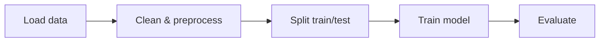

# Machine Learning

Overview
- Machine Learning (ML) is the study of algorithms that learn patterns from data to make predictions or decisions.

Important subtopics
- Supervised Learning: labeled data (classification, regression)
- Unsupervised Learning: no labels (clustering, dimensionality reduction)
- Semi-supervised & Self-supervised Learning
- Model selection, cross-validation, and generalization

Key notes
- Always split data into train/validation/test.
- Feature engineering and scaling often matter more than model choice.
- Evaluate with appropriate metrics (accuracy, precision, recall, F1, ROC-AUC).

Quick example (classifier)
1. Load data (CSV).
2. Split into train/test.
3. Train a `RandomForestClassifier`.
4. Evaluate accuracy and confusion matrix.

Mermaid workflow

Notes on images
- Add a dataset histogram or feature importance plot to `images/ml_feature_importance.png`.
