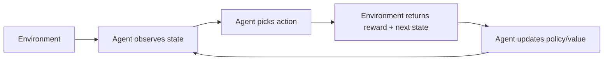

# Reinforcement Learning (RL)

Overview
- RL trains agents to take actions in an environment to maximize cumulative reward.

Important subtopics
- Model-free (Q-learning, DQN, Policy Gradients) vs model-based methods
- Temporal Difference learning and Monte Carlo methods
- Exploration vs exploitation (epsilon-greedy, UCB)

Key notes
- Define a clear reward function; shaping rewards matters critically.
- Simulators (Gym, MuJoCo) are commonly used for training.

Quick example (game agent)
- Train a DQN agent on the CartPole environment to balance the pole.

Mermaid pipeline

Notes on images
- Add a reward-over-time chart at `images/rl_reward_curve.png`.
