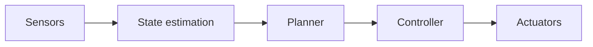

# Robotics

Overview
- Robotics integrates perception, planning, and control so physical agents can act in the real world.

Important subtopics
- Sensing (lidar, camera, IMU), state estimation (Kalman filters)
- Motion planning (A*, RRT), control (PID, MPC)
- Sim-to-real transfer and safety constraints

Key notes
- Real-world robotics introduces hardware constraints, latency, and safety requirements.

Quick example (mobile robot)
- Plan a path with A* on a grid map, then follow with a PID controller for motors.

Mermaid pipeline

Notes on images
- Add a map + planned path visualization: `images/robot_path.png`.
