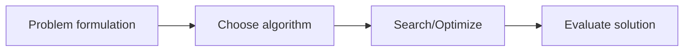

# Search and Optimization

Overview
- Techniques for exploring solution spaces and optimizing objective functions.

Important subtopics
- Heuristic search (A*, greedy), graph algorithms
- Numerical optimization (gradient descent, convex vs non-convex)
- Metaheuristics (GA, simulated annealing)

Key notes
- Choose algorithms based on problem structure (discrete search vs continuous optimization).

Quick example (shortest path)
- Use A* on a grid with Manhattan or Euclidean heuristics to find shortest path.

Mermaid pipeline

Notes on images
- Add a search tree or convergence plot: `images/optimization_convergence.png`.
